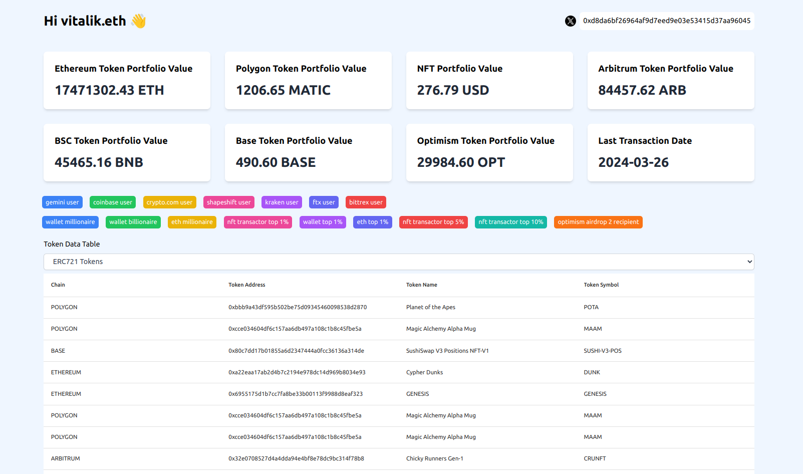
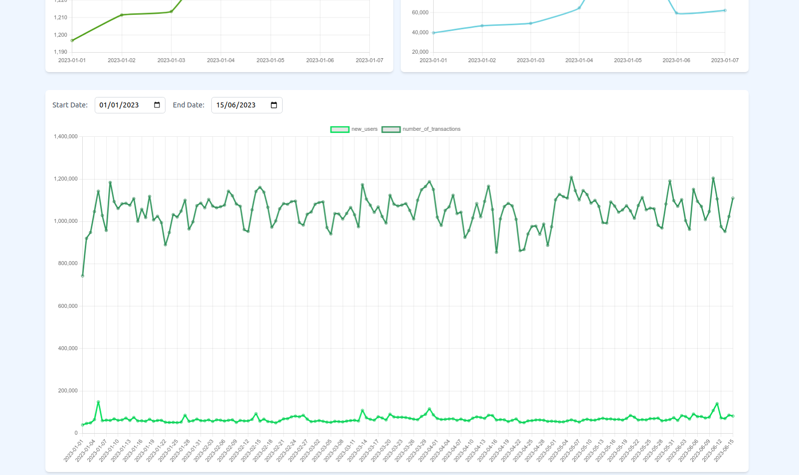
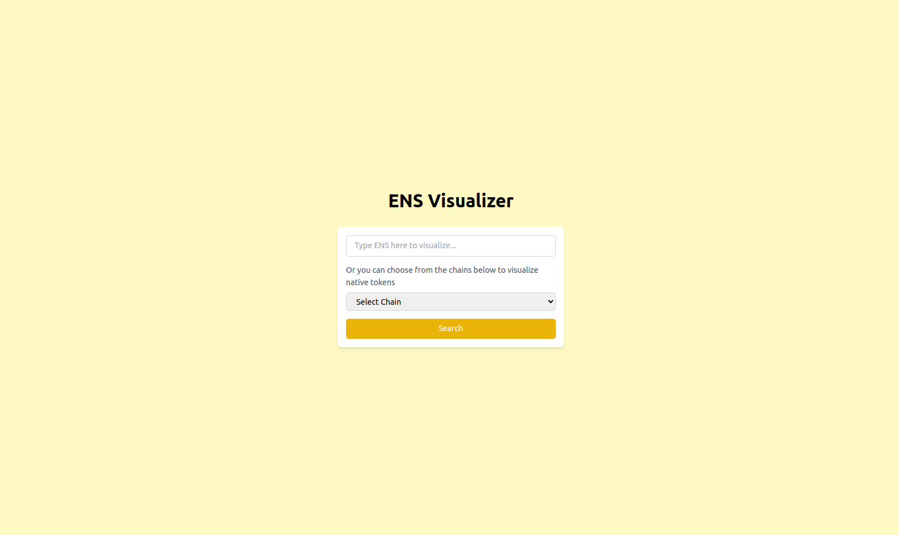

Welcome to Trens! Trens is a web-based application built using Next.js.








## Installation

To run Trens locally, follow these steps:

1. Clone the repository:
   ```
   git clone https://github.com/shuklaritvik06/trens-frontend.git
   ```

2. Navigate to the project directory:
   ```
   cd trens-frontend
   ```

3. Install dependencies:
   ```
   npm install
   ```
4. Setup .env.local file

   ```
   Use the .env.example file to create your own .env.local file
   ```
5. You can get the Moralis API Key from https://moralis.io/

5. Run the development server:
   ```
   npm run dev
   ```

6. Open your browser and visit `http://localhost:3000` to view the application.

### License
This project is licensed under the MIT License - see the [LICENSE](LICENSE) file for details.
